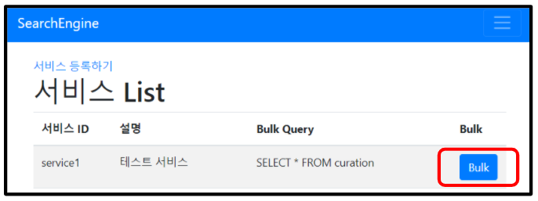

# 1. 컨텐츠 Bulk API 명세

## API

| URI                 | Method  | 설명                  |
| ------------------- | ------- | --------------------- |
| /simple/search/bulk | **GET** | 전체 데이터 Bulk 처리 |

- RDB에 있는 데이터를 **Elasticsearch**로 저장하는 API
- 대량의 데이터를 index(색인)하는 것을 의미

## 1.1 Request

### 1.1.1 Request Header

| Header       | Value            |
| ------------ | ---------------- |
| Content-Type | application/json |

### 1.1.2 Request Parameter

클라이언트는 아래의 규격에 맞게 parameter를 Setting하여 요청한다.

| 데이터 항목   | 변수 이름  | 타입   | 비고                          |
| ------------- | ---------- | ------ | ----------------------------- |
| 서비스 아이디 | service_id | String | Admin에서 등록한 서비스 ID 값 |

### 1.1.3 Request JSON 구조

```json
{
    "service_id":"SVC_QNA"
}
```

## 1.2 Response

### 1.2.1 Response Code

- **Normal**: Ok (200)
- **Error**: Bad Request (400), Not Found (404), Internal Server Error (500), Service Unavailable (503)

### 1.2.2 Response Parameter

서버는 아래의 규격에 맞게 parameter를 Setting하여 응답한다.

| 데이터 항목   | 변수 이름  | 타입   | 비고                          |
| ------------- | ---------- | ------ | ----------------------------- |
| N/A | | | |

---

## 1.3 관리자 화면



- 관리자가 등록한 Service ID가 index 명으로 저장`(prefix 포함)`
- 모든 RDB Row 데이터가 document로 저장
