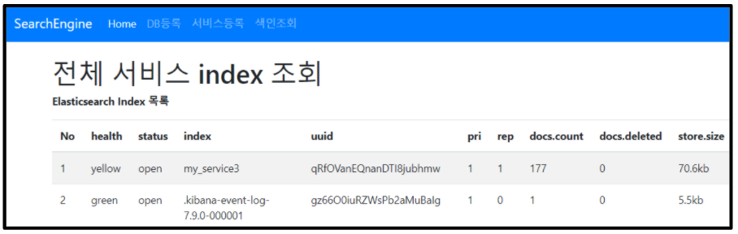

# 2. 색인 List 조회 API 명세

## API

| URI                  | Method  | 설명                        |
| -------------------- | ------- | --------------------------- |
| /simple/viewBulkList | **GET** | Bulk 처리된 전체 Index 조회 |

- **Elasticsearch**에 저장된 전체 Index List 조회
- 관리자 Page로 확인 가능
- Index를 삭제할 수 있는 기능 제공

## 2.1 Request

### 2.1.1 Request Header

| Header       | Value            |
| ------------ | ---------------- |
| Content-Type | application/json |

### 2.1.2 Request Parameter

클라이언트는 아래의 규격에 맞게 parameter를 Setting하여 요청한다.

| 데이터 항목 | 변수 이름 | 타입 | 비고 |
| ----------- | --------- | ---- | ---- |
| N/A         |           |      |      |

## 2.2 Response

### 2.2.1 Response Code

- **Normal**: Ok (200)
- **Error**: Bad Request (400), Not Found (404), Internal Server Error (500), Service Unavailable (503)

### 2.2.2 Response Parameter

서버는 아래의 규격에 맞게 parameter를 Setting하여 응답한다.

| 데이터 항목 | 변수 이름 | 타입 | 비고 |
| ----------- | --------- | ---- | ---- |
| N/A         |           |      |      |

---

## 2.3 관리자 화면

- Bulk 된 Index 조회 가능
- Index를 삭제할 수 있는 버튼 포함
