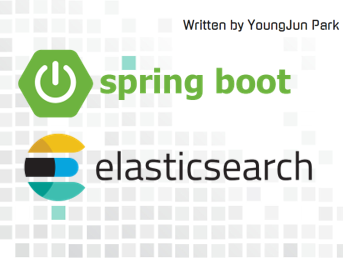

    
    <h2 align="center">Spring boot based ElasticSearch</h2>
    
Just Search and Indexing Page   Spring boot REST API with ElasticSearch

    
    
    
    
     
     
    <a>

---

## 프로젝트 개요

**ElasticSearch** 기반 검색엔진 구축

관계형 DB에 저장된 Data 색인 - 빠르고 쉽게 검색 엔진 활용할 수 있는 시스템 구축  

- ElasticSearch 기반의 검색엔진을 구축 후 관계형 DB에 저장된 Data(ex. QnA, 공지사항 등)에 대해 데이터를 색인하여 빠르고 쉽게 검색 엔진을 활용할 수 있는 시스템을 구축한다.

---

### 1. 📘 API 명세

- [1. 컨텐츠 Bulk API 명세](Docs/API-reference/1-BulkAPI.md)
- [2. 색인 List 조회 API 명세](Docs/API-reference/2-IndexListAPI.md)
- [3. 컨텐츠 검색 API 명세](Docs/API-reference/3-SearchAPI.md)
- [4. 컨텐츠 부분 색인 API 명세](Docs/API-reference/4-PartIndexAPI.md)

---

### 2. 📗 System Architecture

---

### 3. 📕 기술 요구 사항

Technical Requirements Specification

- DB 데이터 색인 및 벌크
- 검색 Rest API 제공
- 관리 화면 제공
- 동적 색인 처리
- 검색 옵션(하이라이트) 기능 제공 처리

---

### 4. 📙 제약사항

~~모든 입출력은 JSON 형태~~

- **API 기능명세에 기술된 API 모두 개발**
→ 검색 컨텐츠 조회 API
→ 컨텐츠 Bulk API 
→ 컴텐츠 부분 색인 API

- **관리자 화면**
→ Spring boot 프레임웍
→ DB 지정 후 전체 색인 처리 기능
→ DB 지정 후 부분 색인 처리 기능
→ 색인된 index 확인 기능

- **단위 테스트(Unit Test)**
→ Test Code 작성
→ 기능 검증

---

### 5. 📒 요구사항 명세서

| RQ-ID  | 구분     | 요구사항명    | 요구사항 내용                                                      |
| ------ | -------- | ------------- | ------------------------------------------------------------------ |
| RQ-001 | 검색엔진 | 검색엔진 설치 | 검색엔진 ElasticSearch 클러스터를 구성                             |
| RQ-002 | API      | 전체색인      | 컨텐츠 Bulk 처리 API가 제공                                        |
| RQ-003 |          | 색인 삭제     | 재 색인처리를 위해 Index 삭제 기능 제공                            |
| RQ-004 |          | 검색          | 검색 컨텐츠 조회 API가 제공                                        |
| RQ-005 |          | 부분색인      | 컨텐츠 부분 색인 (create, update, delete) API가 제공               |
| RQ-006 |          | 검색옵션      | 검색 시 매칭 문자열에 대해 하이라이트 기능이 제공                  |
| RQ-007 | Admin    | DB정보 저장   | 관리자 화면을 통해 DB 정보를 저장하는 기능이 제공                  |
| RQ-008 |          | 색인처리      | 관리자 화면을 통해 대상 DB지정 후 전체 색인을 처리하는 기능이 제공 |
| RQ-009 |          | 색인 List조회 | 관리자 화면을 통해 색인된 Index List를 확인                        |
